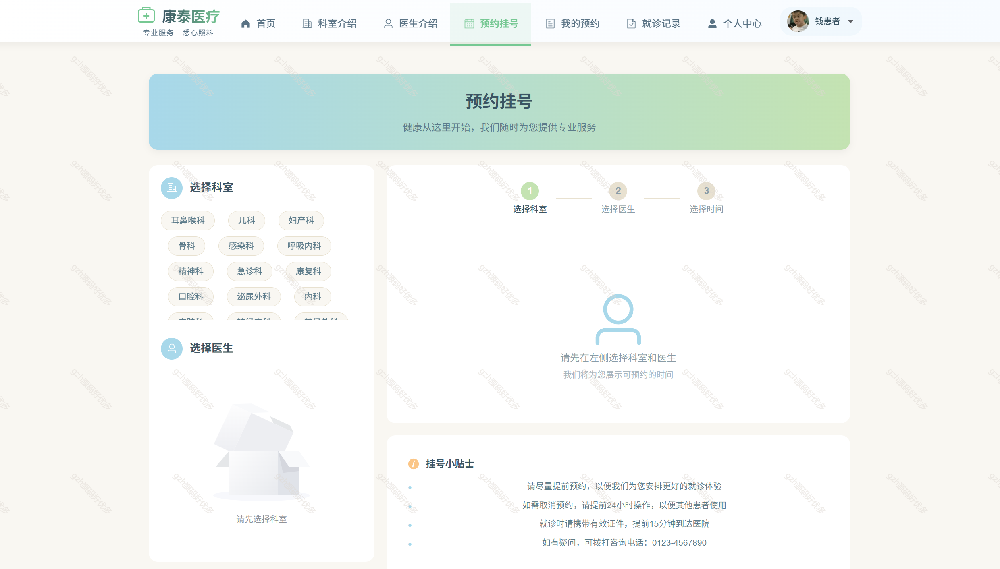

# springbootA507
springbootA507医院医疗服务管理系统
 
## 查看主页获取源码

### 一、关键词

医院医疗服务管理系统,医疗管理系统

 

### 二、作品包含

源码+数据库+全套环境和工具资源+部署教程

 

### 三、项目技术

前端技术： vue3 Element Plus Axios Echarts
后端技术：Java、SpringBoot2.0、MyBatis

  

 

### 四、运行环境（以下版本亲测，其他版本未知，请自测）

开发工具：IDEA/eclipse  + VSCODE

数据库：MySQL8

数据库管理工具：Navicat10以上版本

环境配置软件： JDK17 + Maven3.6.3

前端Nodejs：16

浏览器：谷歌浏览器

 

### 五、项目介绍

项目编号：springbootA507

医院信息管理系统是一个基于SpringBoot+Vue3的医疗机构信息管理平台，旨在优化医院日常运营流程，提高医疗服务质量，为患者和医护人员提供更便捷的医疗服务体验。

## 2. 功能模块设计

### 2.1 用户管理模块

2.1.1 用户角色
系统管理员：负责系统维护和用户管理
医生：管理患者信息，查看/创建就诊记录，管理处方
护士：辅助医生工作，管理患者基本信息
患者：查看个人信息，预约挂号，查询就诊记录

#### 2.1.2 功能点
- 用户注册/登录
- 个人信息管理
- 密码修改
- 权限管理

### 2.2 患者管理模块

#### 2.2.1 功能点
- 患者信息录入与管理
- 患者病历管理
- 患者就诊记录查询
- 患者联系方式管理

### 2.3 预约挂号模块

#### 2.3.1 功能点
- 医生排班管理
- 在线预约挂号
- 预约记录查询与管理
- 预约变更与取消

### 2.4 就诊管理模块

#### 2.4.1 功能点
- 患者就诊记录创建
- 诊断结果记录
- 检查项目安排
- 处方开具

### 2.5 药品管理模块

#### 2.5.1 功能点
- 药品信息管理
- 药品库存管理
- 处方药品管理
- 药品使用统计

### 2.6 部门管理模块

#### 2.6.1 功能点
- 医院科室管理
- 科室医生管理
- 科室排班管理

 

### 六、运行截图

